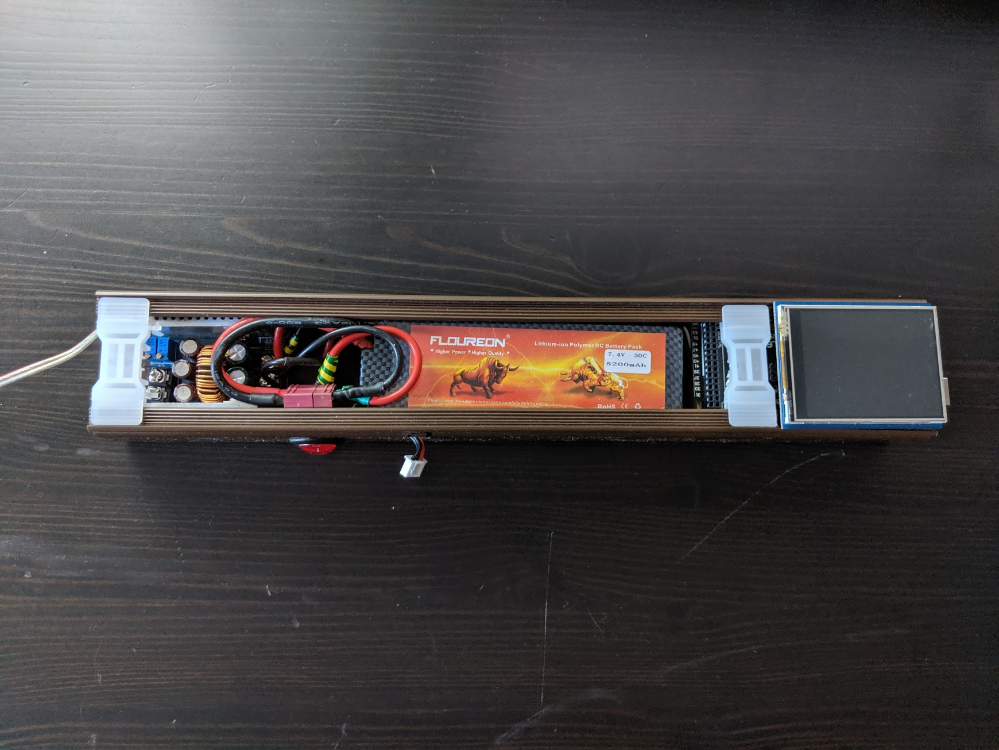

# Material
- 1x Arduino Mega or compatible
    - Example: https://www.amazon.de/Mikrocontroller-ATmega2560-ATMEGA16U2-USB-Kabel-Kompatibel/dp/B01MA5BLQI/
- 1x 2.8" TFT Touch Shield for Arduino
    - Example: https://www.exp-tech.de/displays/tft/4764/adafruit-2.8-tft-touch-shield-fuer-arduino-v2
- 2x WS2812B LED strip with high LED density, ideally 144 LED/m
    - Example: https://www.amazon.de/BTF-LIGHTING-WS2812B-adressierbare-Streifen-NichtWasserdicht/dp/B01CDTEJR0/
- 1x DC/DC Converter, at least 100W rating (to be on the safe side)
    - Example: https://www.amazon.de/Akozon-Wandlermodul-Abwärtswandler-Step-down-Modul-Konstantstrom-LED-Treiber/dp/B07GXQ8MNG/
- 1x LiPo 2S battery, 7.4V
    - Example: https://www.amazon.de/FLOUREON-5200mAh-Deans-T-Stecker-Evader/dp/B00KGS4NZE/
- 1x LiPo compatible charger
- 1x XT60 connector (male)
- 1x cable conduit 40mm x 60mm, length: 30--40cm
- 1x aluminum profile rail, length 2 meters, with plastic cover, not fully transparent
- 1x switch
    - Example: https://www.amazon.de/CARCHET-Wippschalter-Selbsthemmung-Silberfarbe-Korrosionsbestänig/dp/B00OQ01XR4/
- 1x microSD card
- Cables
- Soldering iron
- Multimeter

# Connection Diagram

                        Switch         7.4V     _________
                                    .------- + /         \
     _________           /         /           | Arduino | Data Pin 2 ---------------.
    /         \ +  -----/    -----´      GND - \_________/                            \
    | Battery |                   \                                                    \
    \_________/ - GND              \                                                    \
                                    \   7.4V      _______       5V       ___________     |
                                     `-------- + /       \ + -------- + /           \    |
                                                 | DC/DC |              | LED strip | Data IN
                                           GND - \_______/ - GND  GND - \___________/

    Battery

# Assembly Instructions
- Solder jumper 3 on touch display
    - This enables backlight toggling from software
    - https://learn.adafruit.com/adafruit-2-8-tft-touch-shield-v2/backlight-touch-irq#
- Solder the two LED strips into one
    - TODO
- Solder LED data wire to data pin 2
    - TODO
- Connect LED shield to Arduino
- Flash software

# Usage
- Create image with height of 288 pixels (and arbitrary width)
- *Rotate clockwise by 90 degrees* (image now has *width* of 288 pixels)
- Save as BMP

# Finished assembly

